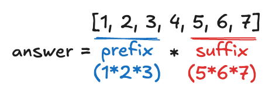

## :book: Product of Array Except Self

### Problem
Given an integer array `nums`, return an array `answer` such that `answer[i]` is equal to the product of all the elements of `nums` except `nums[i]`.

> The product of any prefix or suffix of `nums` is **guaranteed** to fit in a **32-bit** integer.

> You must write an algorithm that runs in $\mathcal{O}(n)$ time and without using the division operation.

### Solution
Note that `0` is a special element, we can derive the following cases:

1. more than two `0`s: `answer` is a list of `0`s
2. only one `0`: `answer` is a list of `0`s except for the position of `0`
3. no `0`s: actually compute the product except self
   
To actually compute the product except self, the idea is to first compute the prefix and suffix, then multiply them together.

<div align="center">
    
    <p><b>Fig. 1 </b>Prefix and Suffix example.</p>
</div>

This can be done by looping from the start/end, simultaneously multipying the prefix/suffix to the element, then update the prefix/suffix for the next/previous element. We write it with 2 for loops, and the time complexity is $\mathcal{O}(2n)=\mathcal{O}(n)$.

```python
def productExceptSelf(nums: List[int]) -> List[int]:
    num_zeros = nums.count(0)
    len_nums = len(nums)
    if num_zeros > 1:
        answer = [0] * len_nums
    elif num_zeros == 1:
        answer = [0] * len_nums
        idx = nums.index(0)
        del nums[idx]
        # `recude(fn, list)` passes `fn` to all `list` elements
        answer[idx] = reduce(lambda x, y: x * y, nums)
    else:
        answer = [1] * len_nums
        prefix, suffix = 1, 1
        # multiplying and updating prefix from the start
        for idx in range(len_nums):
            answer[idx] *= prefix
            prefix *= nums[idx]
        # multipying and updating suffix from the end
        for idx in range(len_nums - 1, -1, -1):
            answer[idx] *= suffix
            suffix *= nums[idx]
    return answer
```
